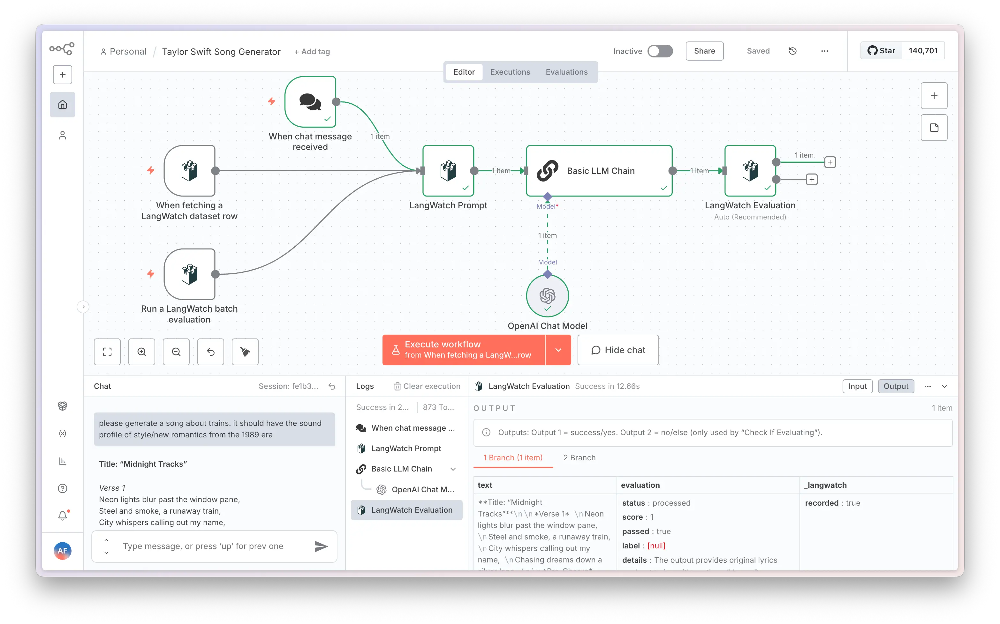
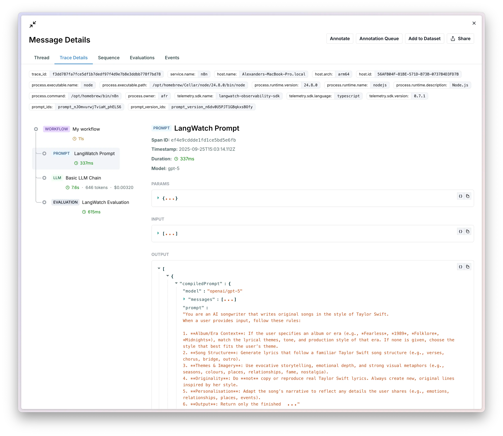
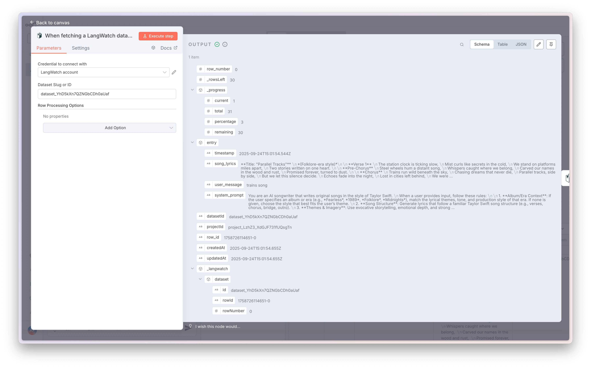
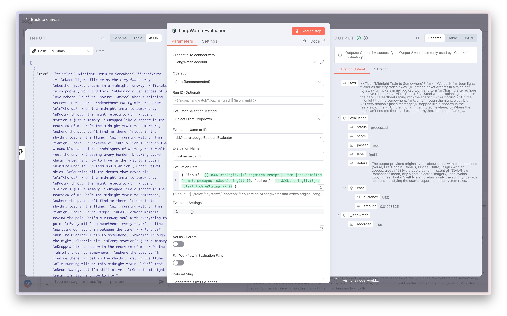
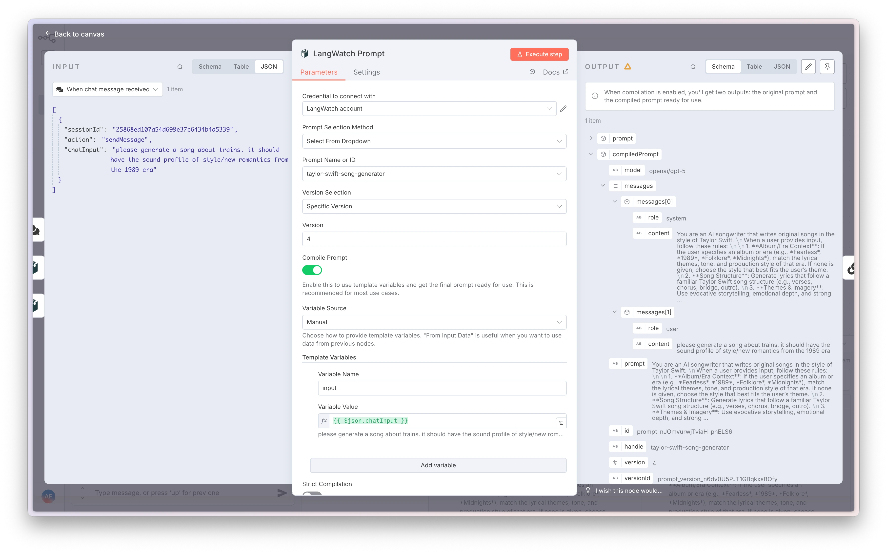

# @langwatch/n8n-nodes-langwatch

This is an n8n community node. It lets you use [LangWatch](https://langwatch.ai) in your n8n workflows.

[LangWatch](https://langwatch.ai) is an LLM observability platform that provides tracing, evaluation, datasets, and prompt management.

[n8n](https://n8n.io/) is a [fair-code licensed](https://docs.n8n.io/reference/license/) workflow automation platform.

## 🚀 **Recommended: Pair with Observability**

For complete LangWatch integration, pair these nodes with `@langwatch/n8n-observability` to automatically trace your n8n workflows:



**Quick setup for self-hosted n8n via npm:**
```bash
npm install -g @langwatch/n8n-observability
export EXTERNAL_HOOK_FILES=$(node -e "console.log(require.resolve('@langwatch/n8n-observability/hooks'))")
export N8N_OTEL_SERVICE_NAME=my-n8n
n8n start
```

## Table of Contents

- [Installation](#installation)  
- [Operations](#operations)  
- [Credentials](#credentials)  
- [Development](#development)  
- [Resources](#resources)

## Installation

### Self-hosted n8n
Follow the [installation guide](https://docs.n8n.io/integrations/community-nodes/installation/) in the n8n community nodes documentation.

```bash
npm install @langwatch/n8n-nodes-langwatch
```

### n8n Cloud
This is a verified community node. Search for `LangWatch` to use this node in n8n Cloud.

## Operations

### Dataset Batch Trigger
Emit one item per dataset row sequentially until done. Optionally initializes an experiment context for batch evaluations.

**Key parameters:**
- Dataset Slug or ID
- Experiment Configuration (enable, ID/Slug, Name, Workflow ID)
- Row Processing Options: startRow, endRow, stepSize, limitRows/maxRows, shuffleRows/seed
- Emit Interval (ms)

**Output fields:**
- `entry` (your dataset row payload)
- `row_number`, `row_id`, `datasetId`, `projectId`, timestamps
- `_progress` { current, total, percentage, remaining }
- `_langwatch.dataset` { id, rowId, rowNumber }
- `_langwatch.experiment` and `_langwatch.batch` when experiment is enabled

### Dataset Row Trigger
Fetch a single dataset row per execution while maintaining an internal cursor. Great for stepwise or scheduled processing.

<div align="center">
  
</div>

**Key parameters:**
- Dataset Slug or ID
- Row Processing Options: startRow, endRow, stepSize, limitRows/maxRows
- Reset Progress, Shuffle Rows, Shuffle Seed

### Evaluation
Run evaluators and/or record results with multiple operation modes.

<div align="center">
  
</div>

**Operations:**
- Auto (Recommended) - automatically selects behavior based on inputs
- Check If Evaluating - determines if running in evaluation context
- Record Result - log a pre-computed evaluation result
- Run and Record - execute an evaluator and log results
- Set Outputs (Dataset) - write entries back to a dataset

**Key parameters:**
- Run ID (optional override; otherwise inferred from `_langwatch.batch.runId`)
- Evaluator selection (manual or dropdown)
- Name, Evaluation Data, Evaluator Settings
- Guardrail flags: `asGuardrail`, `failOnFail`
- Dataset write: `datasetSlug`, `format` (standard/custom), mapping fields

### Prompt
Retrieve and optionally compile a prompt from LangWatch Prompt Manager.

<div align="center">
  
</div>

**Key parameters:**
- Prompt selection: Manual (handle/ID) or Dropdown
- Version selection: Latest or Specific version
- Compile Prompt: Off/On
- Variable Source: Manual, From Input Data, or Mixed
- Strict Compilation: fail if required variables are missing

**Variables:**
- Manual variables: list of name/value pairs (supports n8n expressions)
- Input data variables: map template variable → input data path

## Credentials

To use this node, you need to authenticate with LangWatch. You'll need:

1. A LangWatch account at [app.langwatch.ai](https://app.langwatch.ai)
2. API credentials from your LangWatch project settings: hostname and API key

**How to create:**
1. In n8n, open Settings → Credentials → New
2. Pick "LangWatch API"
3. Fill endpoint and API key → Save → Test

## Development

### Prerequisites
You need the following installed on your development machine:

- [git](https://git-scm.com/downloads)
- Node.js and npm. Minimum version Node 20. You can find instructions on how to install both using nvm (Node Version Manager) for Linux, Mac, and WSL [here](https://github.com/nvm-sh/nvm). For Windows users, refer to Microsoft's guide to [Install NodeJS on Windows](https://docs.microsoft.com/en-us/windows/dev-environment/javascript/nodejs-on-windows).
- Install n8n with:
  ```
  npm install n8n -g
  ```
- Recommended: follow n8n's guide to [set up your development environment](https://docs.n8n.io/integrations/creating-nodes/build/node-development-environment/).

### Build new version
```bash
npm run build
npm link
```

### Test in local n8n
```bash
cd ~/.n8n/custom
npm link n8n-nodes-langwatch
```

## Resources

- [n8n community nodes documentation](https://docs.n8n.io/integrations/#community-nodes)
- [LangWatch documentation](https://docs.langwatch.ai)
- [LangWatch n8n integration](https://docs.langwatch.ai/integrations/n8n)
- [LangWatch Datasets](https://docs.langwatch.ai/datasets/overview)
- [LangWatch Prompts](https://docs.langwatch.ai/features/prompt-versioning#prompt-versioning)
- [LangWatch n8n Observability](https://github.com/langwatch/n8n-observability) - for workflow instrumentation

## License

[MIT](./LICENSE.md)
